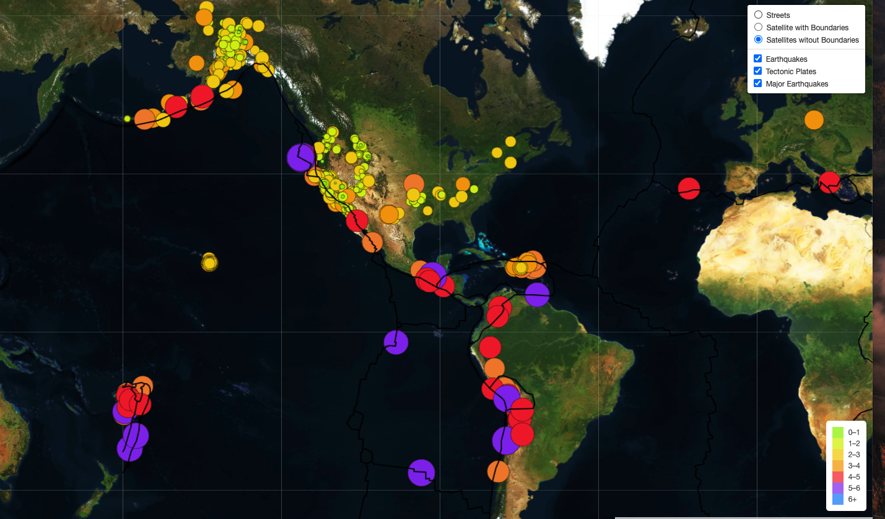

# Mapping_Earthquakes
Mapping Earthquake Data using geomapping.

# Basic Project Plan
## Purpose
The purpose of this project is to visually show the differences between the magnitudes of earthquakes all over the world for the last seven days. We also included an overlay to show the location of all tectonic plates and an overlay to show major earthquakes over 4.0 on the Richter Scale. 

## Tasks
To complete this project, we used a URL for GeoJSON earthquake data from the USGS website and retrieve geographical coordinates and the magnitudes of earthquakes for the last seven days. Then we added the data to a map.

## Approach
We used JavaScript and the D3.js library to retrieve the coordinates and magnitudes of the earthquakes from the GeoJSON data. WE also used the Leaflet library to plot the data on a Mapbox map through an API request and create interactivity for the earthquake data.

### Deliverable 1: Add Tectonic Plate Data

### Deliverable 2: Add Major Earthquake Data

### Deliverable 3: Add an Additional Map

Satellite data with boundaries on the map

Satellite data without boundaries on the map

